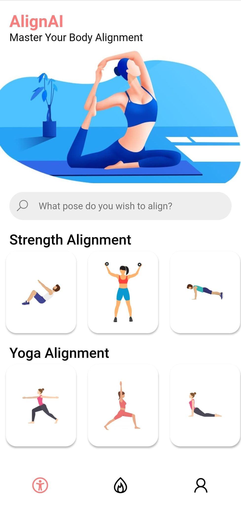

# Hack Western 7 - AlignAI

 

AlignAI is a mobile fitness application that utilizes TensorFLows pose estimation model to determine if a user is doing a specified excersice correctly based on their body alignment

The Flutter app was built in 48 hours for Hack Western, a digital Hackathon. Check out the full app demo here

   

